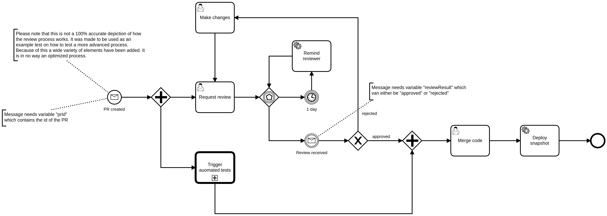
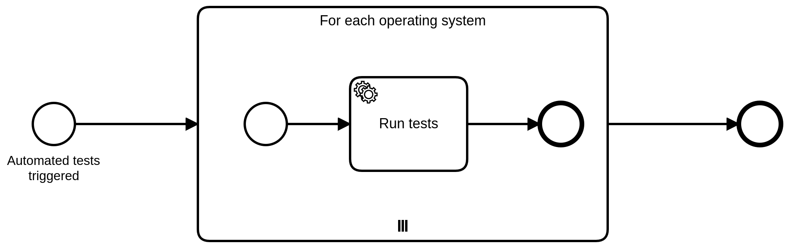

# Examples

This module contains examples on how to use the assertions to test processes.

## Example: _Pull Request Process_

This example demonstrates how to ...
* Annotate a unit tests
* Deploy processes to the test engine
* Control process execution
* Protect tests from flakiness caused by asynchronous processing in the engine
* Manipulate the time of the engine to trigger timer events
* Assert that deployment was successful
* Assert a certain path was taken / not taken
* Assert state of process instance variables
* Navigate from the main process to spawned child process

**Processes**

The example is based on the following process:

[Source](src/test/resources/pr-created.bpmn)

Which calls a subprocess _Automated tests_:

[Source](src/test/resources/automated-tests.bpmn)

**Tests**

[Source](src/test/java/io/camunda/zeebe/process/test/examples/PullRequestProcessTest.java)

